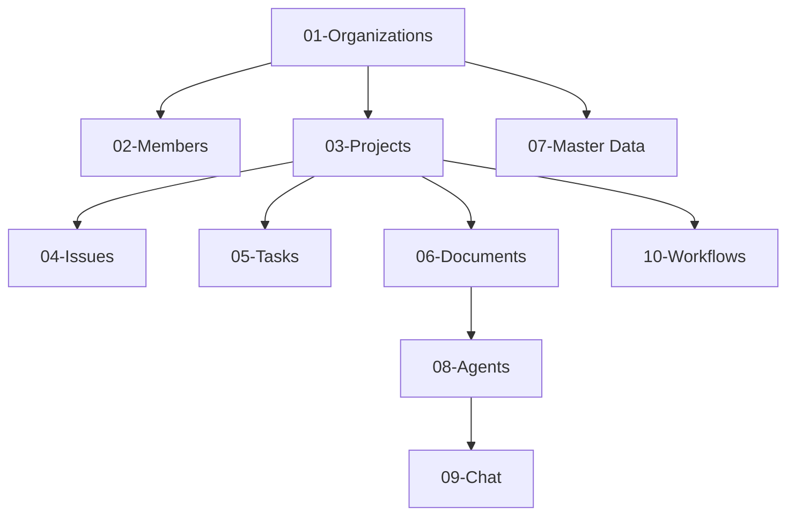

# Backend Modules

**Path:** `docs/details/backend/modules/`  
**Pattern:** Controller → Service → Repository  

---

## 📋 Module Index

Modules sắp xếp theo **dependency order** (module trên là dependency của module dưới):

### 🏢 Foundation (Tenant & Access)

| # | Module | Description | Phase |
|---|--------|-------------|-------|
| 01 | [Organizations](./01-organizations-module.md) | Tenant root, org CRUD | P0 - MVP |
| 02 | [Members](./02-members-module.md) | Membership, roles, invitations | P0 - MVP |

### 📊 Core Business (Project Management)

| # | Module | Description | Phase |
|---|--------|-------------|-------|
| 03 | [Projects](./03-projects-module.md) | Project CRUD (Reference impl) | P0 - MVP |
| 04 | [Issues](./04-issues-module.md) | Bug/issue tracking | P1 - MVP |
| 05 | [Tasks](./05-tasks-module.md) | Task management & assignments | P1 - MVP |
| 06 | [Documents](./06-documents-module.md) | Knowledge base & RAG prep | P1 - MVP |
| 07 | [Master Data](./07-master-data-module.md) | Tags, categories, statuses, roles | P1 - MVP |

### 🤖 AI & Automation (Phase 2)

| # | Module | Description | Phase |
|---|--------|-------------|-------|
| 08 | [Agents](./08-agents-module.md) | AI agent personas | P2 |
| 09 | [Chat](./09-chat-module.md) | AI chat interface | P2 |
| 10 | [Workflows](./10-workflows-module.md) | Automation & state machine | P2 |

---

## 🔧 Implementation Order



---

## 📐 Module Structure Template

```
apps/api/src/modules/{module}/
├── controllers/
│   └── {module}.controller.ts
├── services/
│   └── {module}.service.ts
├── repositories/
│   └── {module}.repository.ts
├── models/
│   └── {module}.model.ts
├── dtos/          → See ../dtos/ for specs
├── routes/
│   └── {module}.routes.ts
└── index.ts
```

---

## 📚 Related

- [DTOs](../dtos/README.md) - DTO specifications per module
- [API Routes Map](../api-routes-map.md) - Full endpoint listing
- [Core Architecture](../core/01-architecture.md) - Layered architecture pattern

---

*Last Updated: 2026-02-13*
