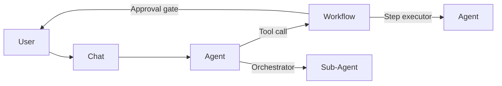
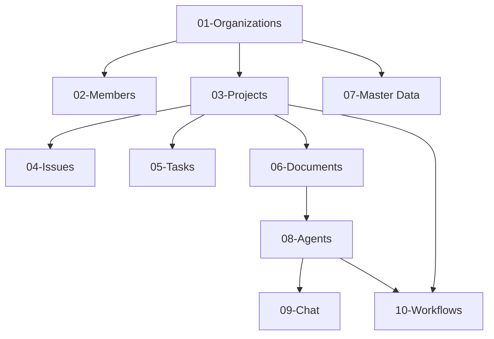

# Backend Modules

**Path:** `docs/details/backend/modules/`  
**Pattern:** Controller → Service → Repository  

---

## 📋 Module Index

Modules sắp xếp theo **dependency order** (module trên là dependency của module dưới):

### 🏢 Foundation (Tenant & Access)

| # | Module | Description | Phase |
|---|--------|-------------|-------|
| 01 | [Organizations](./01-organizations-module.md) | Tenant root, org CRUD | P0 - MVP |
| 02 | [Members](./02-members-module.md) | Membership, roles, invitations | P0 - MVP |

### 📊 Core Business (Project Management)

| # | Module | Description | Phase |
|---|--------|-------------|-------|
| 03 | [Projects](./03-projects-module.md) | Project CRUD (Reference impl) | P0 - MVP |
| 04 | [Issues](./04-issues-module.md) | Bug/issue tracking | P1 - MVP |
| 05 | [Tasks](./05-tasks-module.md) | Task management & assignments | P1 - MVP |
| 06 | [Documents](./06-documents-module.md) | Knowledge base & RAG prep | P1 - MVP |
| 07 | [Master Data](./07-master-data-module.md) | Tags, categories, statuses, roles | P1 - MVP |

### 🤖 AI & Automation (Phase 2)

| # | Module | Description | Phase |
|---|--------|-------------|-------|
| 08 | [Agents](./08-agents-module.md) | AI agents — 4 types: Conversational, Task, Orchestrator, Autonomous | P2 |
| 09 | [Chat](./09-chat-module.md) | Chat interface — 4 types: Simple, RAG, Tool-enabled, Multi-agent | P2 |
| 10 | [Workflows](./10-workflows-module.md) | Workflow engine — 4 types: Linear, Conditional, Event-driven, Human-in-the-loop | P2 |

---

## 🔗 Quan hệ Agent ↔ Workflow ↔ Chat

### Tổng quan

```
User → Chat → Agent
Agent → (Tool) → Workflow
Workflow → Step → Agent
```

- **Agent** là thực thể AI có vai trò, rules, tools, knowledge
- **Workflow** là luồng xử lý graph có cấu trúc (deterministic)
- **Chat** là interface layer (kênh giao tiếp), không phải agent, không phải workflow

### So sánh

| Concept  | Là gì                  | Có logic cố định? | Có AI?    | Có state? |
| -------- | ---------------------- | ----------------- | --------- | --------- |
| Agent    | Thực thể AI có vai trò | Không cố định     | Có        | Có        |
| Workflow | Luồng xử lý graph      | Có                | Có thể có | Có        |
| Chat     | Giao diện hội thoại    | Không             | Có        | Có        |

### Data Flow


```mermaid
graph LR
    U[User] --> CH[Chat]
    CH --> AG[Agent]
    AG -->|Tool call| WF[Workflow]
    WF -->|Step executor| AG2[Agent]
    AG -->|Orchestrator| AG3[Sub-Agent]
    WF -->|Approval gate| U
```

### Module tổ chức Backend

```
modules/
 ├─ agents/           → Định nghĩa agent (CRUD, config, execution)
 ├─ workflows/        → Định nghĩa workflow graph (templates, instances)
 ├─ ai/ (ai-core)     → LLM providers, orchestrator, RAG pipeline
 └─ chat/             → Conversation state, messages, WebSocket
```

> **Note:** Hiện tại `agents/` + `chat/` nằm chung trong `ai/` module.
> Khi refactor, sẽ tách thành 4 module riêng biệt ở trên.

---

## 🔧 Implementation Order


```mermaid
graph TD
    A[01-Organizations] --> B[02-Members]
    A --> C[03-Projects]
    C --> D[04-Issues]
    C --> E[05-Tasks]
    C --> F[06-Documents]
    A --> G[07-Master Data]
    F --> H[08-Agents]
    H --> I[09-Chat]
    H --> J[10-Workflows]
    C --> J
```

---

## 📐 Module Structure Template

```
apps/api/src/modules/{module}/
├── controllers/
│   └── {module}.controller.ts
├── services/
│   └── {module}.service.ts
├── repositories/
│   └── {module}.repository.ts
├── models/
│   └── {module}.model.ts
├── dtos/          → See ../dtos/ for specs
├── routes/
│   └── {module}.routes.ts
└── index.ts
```

---

## 📚 Related

- [DTOs](../dtos/README.md) - DTO specifications per module
- [API Routes Map](../api-routes-map.md) - Full endpoint listing
- [Core Architecture](../core/01-architecture.md) - Layered architecture pattern

---

*Last Updated: 2026-02-25*
