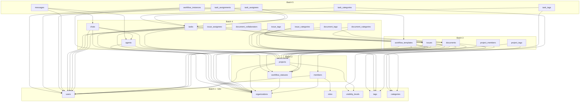

# Thứ Tự Migration Database

**Tổng:** 29 bảng  
**Tool:** Sequelize CLI (`.cjs` migrations)  
**Nguyên tắc:** Bảng **không có FK** tạo trước → bảng **phụ thuộc FK** tạo sau

---

## ⚡ Lệnh thực thi

```bash
# Tạo migration mới
npx sequelize-cli migration:generate --name create-{table_name}

# Chạy tất cả migrations
npx sequelize-cli db:migrate

# Rollback 1 bước
npx sequelize-cli db:migrate:undo

# Rollback tất cả
npx sequelize-cli db:migrate:undo:all
```

### Quy tắc đặt tên file migration

```
YYYYMMDDHHMMSS-create-{table_name}.cjs

Ví dụ:
20260213000001-create-users.cjs
20260213000002-create-organizations.cjs
20260213000003-create-roles.cjs
```

---

## 📋 Thứ tự Migration (5 Batches)

### Batch 1 — Bảng gốc (không có FK)

> Các bảng này không phụ thuộc bảng nào khác

| # | Bảng | Mô tả | Ghi chú |
|---|------|-------|---------|
| 1 | `users` | Tài khoản người dùng | PK cho mọi `created_by`, `updated_by` |
| 2 | `organizations` | Tổ chức (tenant root) | PK cho mọi `organization_id` |
| 3 | `roles` | Vai trò (owner/admin/member) | Seed data sau khi tạo |
| 4 | `visibility_levels` | Mức hiển thị (public/private/...) | Seed data sau khi tạo |
| 5 | `tags` | Nhãn gắn thẻ (FK org là tùy chọn) | `organization_id` nullable |
| 6 | `categories` | Danh mục phân loại | `organization_id` nullable |

**Sau Batch 1 → Chạy seeder:**
```bash
npx sequelize-cli seed:generate --name seed-roles
npx sequelize-cli seed:generate --name seed-visibility-levels
npx sequelize-cli db:seed:all
```

---

### Batch 2 — Phụ thuộc Batch 1

> FK trỏ về `users`, `organizations`, `roles`

| # | Bảng | FK phụ thuộc | Mô tả |
|---|------|-------------|-------|
| 7 | `members` | `users`, `organizations`, `roles` | Thành viên tổ chức |
| 8 | `workflow_statuses` | `organizations` | Trạng thái nghiệp vụ (seed data) |
| 9 | `projects` | `organizations`, `users`, `workflow_statuses`, `visibility_levels` | Dự án |

**Sau Batch 2 → Seed workflow_statuses:**
```bash
npx sequelize-cli seed:generate --name seed-workflow-statuses
```

Seed data mẫu:
```
target_type: 'project'  → open, in_progress, completed, archived
target_type: 'issue'    → open, confirmed, in_progress, resolved, closed
target_type: 'task'     → todo, in_progress, review, done
target_type: 'document' → draft, review, published, archived
```

---

### Batch 3 — Phụ thuộc Batch 2

> FK trỏ về `projects`, `members`, `workflow_statuses`

| # | Bảng | FK phụ thuộc | Mô tả |
|---|------|-------------|-------|
| 10 | `project_members` | `projects`, `members` | Thành viên dự án |
| 11 | `project_tags` | `projects`, `tags` | Gắn tag cho dự án |
| 12 | `issues` | `projects`, `organizations`, `users`, `workflow_statuses` | Vấn đề/Bug |
| 13 | `documents` | `projects`, `organizations`, `users`, `workflow_statuses`, `visibility_levels` | Tài liệu |
| 14 | `workflow_templates` | `organizations`, `projects`, `users`, `workflow_statuses` | Mẫu workflow |

---

### Batch 4 — Phụ thuộc Batch 3

> FK trỏ về `issues`, `documents`, `projects`

| # | Bảng | FK phụ thuộc | Mô tả |
|---|------|-------------|-------|
| 15 | `tasks` | `issues`, `projects`, `organizations`, `users`, `workflow_statuses` | Nhiệm vụ (con của issue) |
| 16 | `agents` | `organizations`, `projects` | AI agent personas |
| 17 | `chats` | `organizations`, `projects`, `users`, `agents` | Phiên chat AI |
| 18 | `issue_assignees` | `issues`, `users` | Người được gán issue |
| 19 | `issue_tags` | `issues`, `tags` | Gắn tag cho issue |
| 20 | `issue_categories` | `issues`, `categories` | Phân loại issue |
| 21 | `document_tags` | `documents`, `tags` | Gắn tag cho tài liệu |
| 22 | `document_categories` | `documents`, `categories` | Phân loại tài liệu |
| 23 | `document_collaborators` | `documents`, `users` | Cộng tác viên tài liệu |

---

### Batch 5 — Phụ thuộc Batch 4

> FK trỏ về `tasks`, `chats`

| # | Bảng | FK phụ thuộc | Mô tả |
|---|------|-------------|-------|
| 24 | `messages` | `chats`, `users`, `agents` | Tin nhắn chat |
| 25 | `task_assignees` | `tasks`, `users` | Người được gán task |
| 26 | `task_assignments` | `tasks`, `users` | Phân công chi tiết (role-based) |
| 27 | `task_tags` | `tasks`, `tags` | Gắn tag cho task |
| 28 | `task_categories` | `tasks`, `categories` | Phân loại task |
| 29 | `workflow_instances` | `workflow_templates`, `organizations`, `users` | Instance đang chạy |

---

## 🔗 Sơ đồ phụ thuộc



---

## ⚠️ Lưu ý quan trọng

1. **Self-reference FK** — `documents.parent_id` trỏ về chính `documents.id` → Thêm FK constraint **sau khi tạo bảng** (dùng `addConstraint` trong migration)
2. **Seed trước khi dùng** — `roles`, `visibility_levels`, `workflow_statuses` cần seed data trước khi tạo `members`, `projects`
3. **Auto-increment** — `issues.number` tự tăng theo `project_id` → Xử lý trong Service layer, không phải migration
4. **UUID** — Tất cả `id` dùng UUID v4 (`VARCHAR(36)`) → Generate bằng `uuid` package trong Model hook

---

## 📚 Tài liệu liên quan

- [Database Tables](./tables/) — Schema chi tiết từng bảng
- [Database Security](./database-security.md) — Bảo mật database
- [Redis Strategy](./redis-strategy.md) — Chiến lược caching
- [Step 7 - Implementation Plan](../../basics/step-7-implementation-plan.md) — Kế hoạch tổng thể

---

*Cập nhật lần cuối: 2026-02-13*
