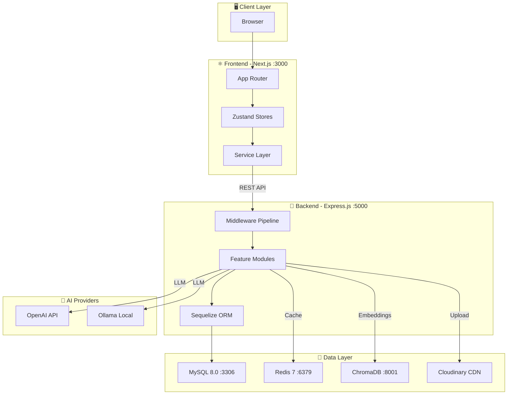
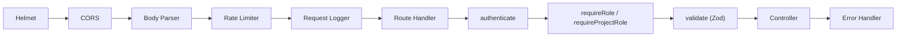
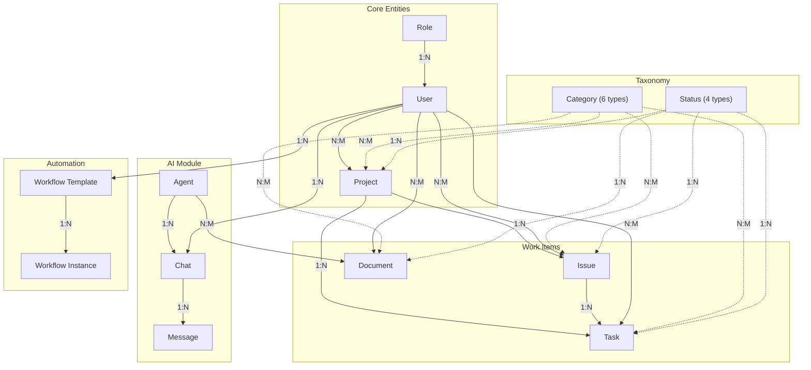

# 📐 Kiến Trúc Tổng Quan — WorkflowHub

> **Version:** 1.0.0 · **Cập nhật:** 2026-03-03

## Mục Lục

- [1. Tổng Quan Hệ Thống](#1-tổng-quan-hệ-thống)
- [2. Tech Stack](#2-tech-stack)
- [3. Kiến Trúc Monorepo](#3-kiến-trúc-monorepo)
- [4. High-Level Architecture](#4-high-level-architecture)
- [5. Backend Architecture](#5-backend-architecture)
- [6. Frontend Architecture](#6-frontend-architecture)
- [7. Module Dependency Graph](#7-module-dependency-graph)

---

## 1. Tổng Quan Hệ Thống

**WorkflowHub** là nền tảng quản lý dự án multi-tenant tích hợp AI, hỗ trợ:

- Quản lý Project, Task, Issue, Document
- Hệ thống Workflow automation (linear, conditional, event-driven, human-in-the-loop)
- AI Agent với hỗ trợ RAG (Retrieval-Augmented Generation) qua ChromaDB
- Role-Based Access Control (RBAC) 2 cấp: system-level + project-level
- Real-time AI Chat với streaming response

---

## 2. Tech Stack

| Layer | Technology | Mô tả |
|-------|-----------|-------|
| **Frontend** | Next.js 14+ (App Router) | SSR/CSR framework |
| | TypeScript | Type safety |
| | TailwindCSS | Utility-first CSS |
| | Zustand | Lightweight state management |
| **Backend** | Express.js | Node.js web framework |
| | Modern JS (ESM + Babel) | ES Module syntax |
| | Sequelize ORM | MySQL ORM |
| | Zod | Schema validation |
| **Database** | MySQL 8.0 | Primary relational database |
| | Redis 7 | Caching & sessions |
| | ChromaDB | AI vector database (embeddings) |
| **AI** | OpenAI API | LLM provider (GPT) |
| | Ollama | Local LLM provider |
| **Upload** | Cloudinary | Image/file storage |
| **Infra** | Docker Compose | Container orchestration |
| | pnpm Monorepo | Package management |
| **Logging** | Winston | Structured logging |

---

## 3. Kiến Trúc Monorepo

```
workflowhub/
├── apps/
│   ├── api/                    # Backend — Express.js (port 5000)
│   │   ├── src/
│   │   │   ├── app.js          # Composition root
│   │   │   ├── server.js       # HTTP server bootstrap
│   │   │   ├── config/         # Environment config
│   │   │   ├── database/       # Models, migrations, seeders
│   │   │   ├── modules/        # 11 feature modules
│   │   │   ├── schemas/        # Zod validation schemas
│   │   │   └── shared/         # Middleware, errors, utils
│   │   └── package.json
│   │
│   └── web/                    # Frontend — Next.js (port 3000)
│       └── src/
│           ├── app/            # App Router (pages + layouts)
│           ├── components/     # UI + feature components
│           ├── constants/      # App constants
│           ├── hooks/          # Custom React hooks
│           ├── lib/            # API client, i18n, utils
│           ├── locales/        # en.json, vi.json
│           ├── services/       # API service layer
│           ├── stores/         # Zustand stores
│           ├── types/          # TypeScript types
│           └── utils/          # Utility functions
│
├── packages/
│   └── shared/                 # Shared constants (roles, HTTP status)
│
├── docker-compose.yml          # MySQL, Redis, ChromaDB, phpMyAdmin
├── pnpm-workspace.yaml         # Workspace config
└── package.json                # Root scripts
```

---

## 4. High-Level Architecture



---

## 5. Backend Architecture

### Middleware Pipeline (thứ tự thực thi)



### Module Pattern (mỗi module tuân theo)

```
modules/{module}/
├── controllers/     # Request handling, response formatting
├── services/        # Business logic
├── repositories/    # Data access (Sequelize queries)
├── routes/          # Express router definitions
└── dtos/            # Data Transfer Objects (optional)
```

**Flow:** `Route → Middleware → Controller → Service → Repository → Model`

### Backend Modules

| Module | Chức năng | RBAC |
|--------|----------|------|
| `auth` | Register, login, refresh token, me | Public / Protected |
| `project` | CRUD projects + member management | System + Project role |
| `task` | CRUD tasks (thuộc project) | Authenticated |
| `issue` | CRUD issues (thuộc project) | Authenticated |
| `document` | CRUD documents + embedding status | Authenticated |
| `category` | CRUD categories (6 types) | Admin/Manager |
| `status` | CRUD statuses (4 types) | Authenticated |
| `user` | User management + role assignment | Admin/Manager |
| `upload` | Image upload/delete (Cloudinary) | Authenticated |
| `workflow` | Templates + instances + execution | Authenticated |
| `ai` | Agents + chat + providers | Authenticated |

---

## 6. Frontend Architecture

### App Router Structure

```
app/
├── (auth)/             # Auth layout (login, register)
│   └── layout.tsx
├── (main)/             # Main app layout (sidebar + header)
│   ├── layout.tsx
│   ├── dashboard/
│   ├── projects/       # CRUD + detail + members
│   ├── tasks/          # CRUD + detail
│   ├── issues/         # CRUD + detail
│   ├── documents/      # CRUD + detail
│   ├── categories/     # Tabs: project, task, issue, document
│   ├── members/        # User management
│   ├── agents/         # AI agent management
│   ├── chat/           # AI chat interface
│   └── workflows/      # Workflow templates + instances
├── contexts/           # React Context providers
└── layout.tsx          # Root layout
```

### State Management (Zustand)

| Store | Quản lý |
|-------|---------|
| `useAuthStore` | User session, tokens, login/logout |
| `useProjectStore` | Projects CRUD + filtering |
| `useTaskStore` | Tasks CRUD + filtering |
| `useIssueStore` | Issues CRUD + filtering |
| `useDocumentStore` | Documents CRUD + filtering |
| `useCategoryStore` | Categories (6 types) |
| `useStatusStore` | Statuses (4 types) |
| `useMemberStore` | User/member management |
| `useAIStore` | AI agents CRUD |
| `useLayoutStore` | Sidebar, theme, UI state |

---

## 7. Module Dependency Graph



---

> **Xem thêm:**
> - [02 — Getting Started](./02-getting-started.md)
> - [03 — Database Schema](./03-database-schema.md)
> - [04 — API Reference](./04-api-reference.md)
> - [05 — Backend Architecture](./05-backend-architecture.md)
> - [06 — Frontend Architecture](./06-frontend-architecture.md)
