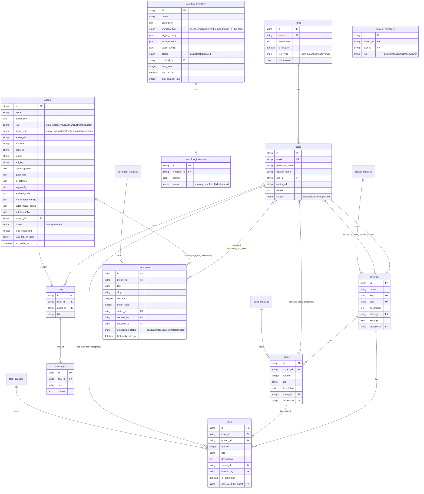

# 🗄️ Database Schema — WorkflowHub

> **Version:** 1.0.0 · **Cập nhật:** 2026-03-03 · **ORM:** Sequelize · **Database:** MySQL 8.0

## Mục Lục

- [1. ER Diagram](#1-er-diagram)
- [2. Core Tables](#2-core-tables)
- [3. Work Item Tables](#3-work-item-tables)
- [4. AI Module Tables](#4-ai-module-tables)
- [5. Workflow Tables](#5-workflow-tables)
- [6. Taxonomy Tables](#6-taxonomy-tables)
- [7. Junction Tables](#7-junction-tables)
- [8. Conventions](#8-conventions)

---

## 1. ER Diagram

---

## 2. Core Tables

### `roles`

| Column | Type | Constraints | Mô tả |
|--------|------|-------------|-------|
| `id` | STRING(36) | PK | UUID |
| `name` | STRING(50) | UNIQUE, NOT NULL | Tên hiển thị |
| `description` | TEXT | nullable | Mô tả role |
| `is_system` | BOOLEAN | default: false | Role hệ thống (không xóa được) |
| `role_type` | ENUM | default: 'user' | `admin` \| `manager` \| `user` \| `viewer` |
| `permissions` | JSON | nullable | Permission map (future) |

### `users`

| Column | Type | Constraints | Mô tả |
|--------|------|-------------|-------|
| `id` | STRING(36) | PK | UUID |
| `email` | STRING(255) | UNIQUE, NOT NULL | Email đăng nhập |
| `password_hash` | STRING(255) | NOT NULL | bcrypt hash |
| `display_name` | STRING(100) | NOT NULL | Tên hiển thị |
| `role_id` | STRING(36) | FK → roles.id | System role |
| `avatar_url` | STRING(500) | nullable | URL avatar (Cloudinary) |
| `details` | JSON | nullable | Metadata mở rộng |
| `status` | ENUM | default: 'active' | `active` \| `inactive` \| `suspended` |

### `projects`

| Column | Type | Constraints | Mô tả |
|--------|------|-------------|-------|
| `id` | STRING(36) | PK | UUID |
| `name` | STRING(100) | NOT NULL | Tên project |
| `key` | STRING(10) | UNIQUE, nullable | Mã viết tắt (VD: `WH`) |
| `slug` | STRING(100) | UNIQUE, NOT NULL | URL-friendly name |
| `description` | TEXT | NOT NULL | Mô tả |
| `status_id` | STRING(36) | FK → project_statuses.id | Trạng thái |
| `settings` | JSON | nullable | Project settings |
| `created_by` | STRING(36) | FK → users.id | Người tạo |

### `project_members`

| Column | Type | Constraints | Mô tả |
|--------|------|-------------|-------|
| `id` | STRING(36) | PK | UUID |
| `project_id` | STRING(36) | FK → projects.id | Project |
| `user_id` | STRING(36) | FK → users.id | Member |
| `role` | STRING | NOT NULL | `admin` \| `manager` \| `member` \| `viewer` |

---

## 3. Work Item Tables

### `tasks`

| Column | Type | Constraints | Mô tả |
|--------|------|-------------|-------|
| `id` | STRING(36) | PK | UUID |
| `issue_id` | STRING(36) | FK → issues.id, nullable | Parent issue |
| `project_id` | STRING(36) | FK → projects.id | Project sở hữu |
| `number` | INTEGER | NOT NULL | Số thứ tự auto-increment per project |
| `title` | STRING(200) | NOT NULL | Tiêu đề |
| `description` | TEXT | NOT NULL | Nội dung |
| `status_id` | STRING(36) | FK → task_statuses.id | Trạng thái |
| `created_by` | STRING(36) | FK → users.id | Người tạo |
| `ai_generated` | BOOLEAN | default: false | Được tạo bởi AI? |
| `generated_by_agent` | STRING(36) | FK → agents.id, nullable | Agent tạo |

### `issues`

| Column | Type | Constraints | Mô tả |
|--------|------|-------------|-------|
| `id` | STRING(36) | PK | UUID |
| `project_id` | STRING(36) | FK → projects.id | Project sở hữu |
| `number` | INTEGER | NOT NULL | Số thứ tự |
| `title` | STRING(200) | NOT NULL | Tiêu đề |
| `description` | TEXT | NOT NULL | Nội dung |
| `status_id` | STRING(36) | FK → issue_statuses.id | Trạng thái |
| `reporter_id` | STRING(36) | FK → users.id | Người báo cáo |

### `documents`

| Column | Type | Constraints | Mô tả |
|--------|------|-------------|-------|
| `id` | STRING(36) | PK | UUID |
| `project_id` | STRING(36) | FK → projects.id, nullable | Project (nullable = global doc) |
| `title` | STRING(200) | NOT NULL | Tiêu đề |
| `slug` | STRING(200) | NOT NULL | URL slug |
| `content` | LONGTEXT | NOT NULL | Nội dung (markdown/HTML) |
| `order_index` | INTEGER | default: 0 | Thứ tự sắp xếp |
| `status_id` | STRING(36) | FK → document_statuses.id | Trạng thái |
| `created_by` | STRING(36) | FK → users.id | Người tạo |
| `updated_by` | STRING(36) | FK → users.id, nullable | Người sửa cuối |
| `embedding_status` | ENUM | default: 'pending' | `pending` \| `processing` \| `completed` \| `failed` |
| `last_embedded_at` | DATETIME | nullable | Lần embed cuối |

---

## 4. AI Module Tables

### `agents`

| Column | Type | Constraints | Mô tả |
|--------|------|-------------|-------|
| `id` | STRING(36) | PK | UUID |
| `name` | STRING(100) | NOT NULL | Tên agent |
| `description` | TEXT | nullable | Mô tả |
| `role` | ENUM | default: 'custom' | `pm` \| `developer` \| `reviewer` \| `analyst` \| `writer` \| `custom` |
| `agent_type` | ENUM | default: 'conversational' | `conversational` \| `task` \| `orchestrator` \| `autonomous` |
| `avatar_url` | STRING(255) | nullable | Avatar |
| `provider` | STRING(50) | NOT NULL | `openai` \| `ollama` \| ... |
| `base_url` | STRING(255) | nullable | Custom API endpoint |
| `model` | STRING(100) | NOT NULL | Model name (VD: `gpt-4o`) |
| `api_key` | STRING(512) | nullable | API key riêng cho agent |
| `system_prompt` | TEXT | NOT NULL | System prompt |
| `guardrails` | JSON | nullable | Safety config |
| `ai_settings` | JSON | nullable | Temperature, max_tokens, ... |
| `rag_config` | JSON | nullable | RAG configuration |
| `enabled_tools` | JSON | nullable | Tool list |
| `orchestrator_config` | JSON | nullable | Multi-agent orchestration |
| `autonomous_config` | JSON | nullable | Autonomous mode config |
| `output_config` | JSON | nullable | Output formatting |
| `project_id` | STRING(36) | FK → projects.id, nullable | Gắn với project |
| `status` | ENUM | default: 'active' | `active` \| `disabled` |
| `total_executions` | INTEGER | default: 0 | Tổng số lần chạy |
| `total_tokens_used` | BIGINT | default: 0 | Tổng tokens đã dùng |
| `last_used_at` | DATETIME | nullable | Lần dùng cuối |

### `chats`

| Column | Type | Constraints | Mô tả |
|--------|------|-------------|-------|
| `id` | STRING(36) | PK | UUID |
| `user_id` | STRING(36) | FK → users.id | Người dùng sở hữu |
| `agent_id` | STRING(36) | FK → agents.id | Agent được dùng |
| `title` | STRING | NOT NULL | Tiêu đề conversation |

### `messages`

| Column | Type | Constraints | Mô tả |
|--------|------|-------------|-------|
| `id` | STRING(36) | PK | UUID |
| `chat_id` | STRING(36) | FK → chats.id | Conversation |
| `role` | STRING | NOT NULL | `user` \| `assistant` \| `system` |
| `content` | TEXT | NOT NULL | Nội dung tin nhắn |

---

## 5. Workflow Tables

### `workflow_templates`

| Column | Type | Constraints | Mô tả |
|--------|------|-------------|-------|
| `id` | STRING(36) | PK | UUID |
| `name` | STRING(100) | NOT NULL | Tên template |
| `description` | TEXT | nullable | Mô tả |
| `workflow_type` | ENUM | default: 'linear' | `linear` \| `conditional` \| `event_driven` \| `human_in_the_loop` |
| `trigger_config` | JSON | NOT NULL | Trigger configuration |
| `input_schema` | JSON | nullable | Input validation schema |
| `steps_config` | JSON | NOT NULL | Workflow steps definition |
| `status` | ENUM | default: 'draft' | `active` \| `draft` \| `archived` |
| `created_by` | STRING(36) | FK → users.id | Người tạo |
| `total_runs` | INTEGER | default: 0 | Tổng lần chạy |
| `last_run_at` | DATETIME | nullable | Lần chạy cuối |
| `avg_duration_ms` | INTEGER | default: 0 | Thời gian trung bình |

### `workflow_instances`

| Column | Type | Constraints | Mô tả |
|--------|------|-------------|-------|
| `id` | STRING(36) | PK | UUID |
| `template_id` | STRING(36) | FK → workflow_templates.id | Template gốc |
| `context` | JSON | nullable | Runtime context/data |
| `status` | ENUM | | `running` \| `completed` \| `failed` \| `paused` |

---

## 6. Taxonomy Tables

### Status Tables (4 loại)

Cấu trúc giống nhau cho: `project_statuses`, `task_statuses`, `issue_statuses`, `document_statuses`

| Column | Type | Constraints | Mô tả |
|--------|------|-------------|-------|
| `id` | STRING(36) | PK | UUID |
| `name` | STRING(50) | NOT NULL | Tên status |
| `key` | STRING(50) | NOT NULL | Unique key |
| `color` | STRING(20) | nullable | Hex color code |
| `order_index` | INTEGER | default: 0 | Thứ tự hiển thị |
| `is_default` | BOOLEAN | default: false | Status mặc định? |

### Category Tables (6 loại)

Cấu trúc giống nhau cho: `project_categories`, `task_categories`, `issue_categories`, `document_categories`, `workflow_categories`, `member_categories`

| Column | Type | Constraints | Mô tả |
|--------|------|-------------|-------|
| `id` | STRING(36) | PK | UUID |
| `name` | STRING(50) | NOT NULL | Tên category |
| `key` | STRING(50) | NOT NULL | Unique key |
| `description` | TEXT | nullable | Mô tả |
| `order_index` | INTEGER | default: 0 | Thứ tự hiển thị |

---

## 7. Junction Tables (Many-to-Many)

| Table | Entity A | Entity B |
|-------|----------|----------|
| `project_members` | projects | users |
| `task_assignees` | tasks | users |
| `issue_assignees` | issues | users |
| `document_assignees` | documents | users |
| `agent_documents` | agents | documents |
| `project_category_mappings` | projects | project_categories |
| `task_category_mappings` | tasks | task_categories |
| `issue_category_mappings` | issues | issue_categories |
| `document_category_mappings` | documents | document_categories |
| `workflow_category_mappings` | workflow_templates | workflow_categories |
| `member_category_mappings` | users | member_categories |

---

## 8. Conventions

| Quy tắc | Giá trị |
|---------|---------|
| **Primary Key** | UUID string (36 chars), field name: `id` |
| **Foreign Key** | Pattern: `{entity}_id` (VD: `project_id`) |
| **Naming** | `snake_case` cho tất cả columns |
| **Timestamps** | `created_at`, `updated_at` (auto-managed by Sequelize) |
| **Soft Delete** | Không sử dụng — hard delete |
| **ENUM values** | Lowercase, underscore separated |
| **JSON columns** | Dùng cho flexible/dynamic data (settings, configs) |

---

> **Xem thêm:**
> - [01 — Architecture Overview](./01-architecture-overview.md)
> - [04 — API Reference](./04-api-reference.md)
