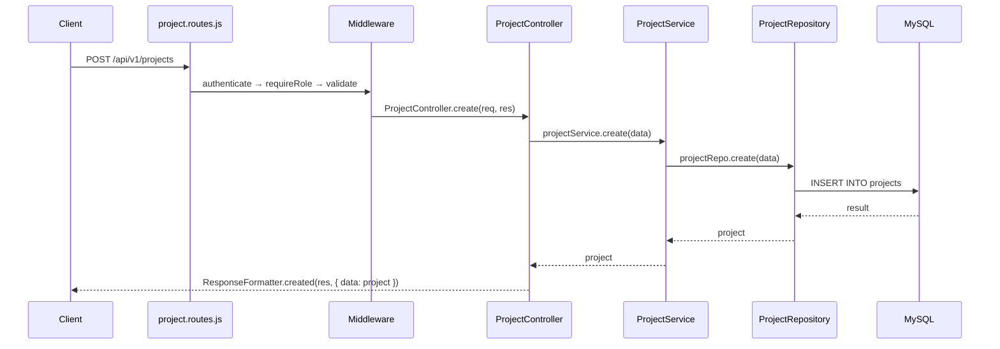
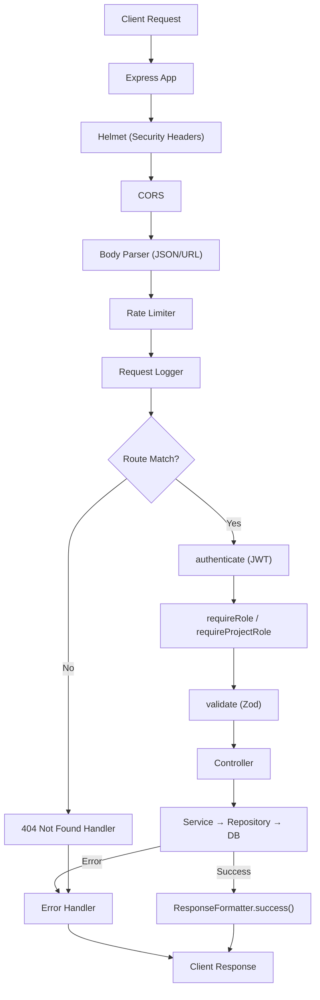
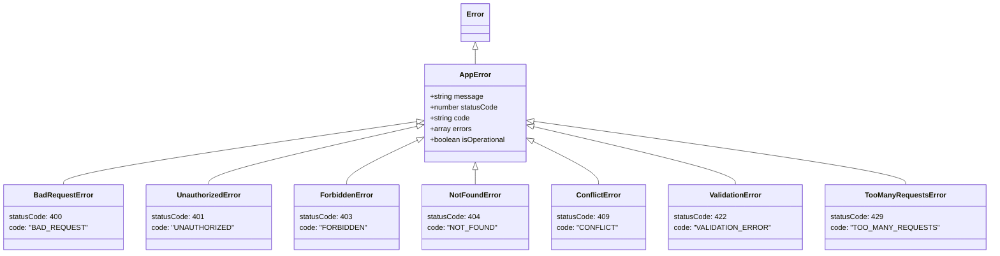

# 🔧 Backend Architecture — WorkflowHub

> **Version:** 1.0.0 · **Cập nhật:** 2026-03-03

## Mục Lục

- [1. Module Anatomy](#1-module-anatomy)
- [2. Request Lifecycle](#2-request-lifecycle)
- [3. Middleware Pipeline](#3-middleware-pipeline)
- [4. Error Handling](#4-error-handling)
- [5. Validation (Zod)](#5-validation-zod)
- [6. Response Formatter](#6-response-formatter)
- [7. Logging](#7-logging)
- [8. Config Management](#8-config-management)
- [9. Database Layer](#9-database-layer)

---

## 1. Module Anatomy

Mỗi backend module tuân theo cấu trúc **Controller → Service → Repository → Model**:

```
modules/{moduleName}/
├── controllers/
│   └── {module}.controller.js    # Request handling, response
├── services/
│   └── {module}.service.js       # Business logic
├── repositories/
│   └── {module}.repository.js    # Sequelize queries
├── routes/
│   └── {module}.routes.js        # Express router + middleware
└── dtos/                         # (Optional) Data Transfer Objects
    ├── create-{module}.dto.js
    └── update-{module}.dto.js
```

### Trách nhiệm từng layer

| Layer | Trách nhiệm | Ví dụ |
|-------|-------------|-------|
| **Controller** | Parse request, gọi service, format response | `ProjectController.create()` |
| **Service** | Business logic, validation rules, orchestration | `ProjectService.create()` |
| **Repository** | Data access, Sequelize queries | `ProjectRepository.findAll()` |
| **Model** | Schema definition, associations | `Project.init()`, `Project.associate()` |
| **DTO** | Zod schemas cho input validation | `createProjectSchema` |

### Ví dụ: Project Module Flow



---

## 2. Request Lifecycle



---

## 3. Middleware Pipeline

### 3.1. `authenticate` — JWT Authentication

**File:** `shared/middleware/auth.middleware.js`

- Kiểm tra header `Authorization: Bearer <token>`
- Verify JWT access token
- Gắn `req.user = { id, email }` cho downstream middleware

```
req.user = {
  id: "user-uuid",
  email: "user@example.com"
}
```

### 3.2. `requireRole` — System-Level RBAC

**File:** `shared/middleware/rbac.middleware.js`

- Factory function: `requireRole(['admin', 'manager'])`
- Query User → Role từ DB
- Check `role.role_type` against allowed list
- Gắn `req.userRole` cho downstream

### 3.3. `requireProjectRole` — Project-Level RBAC

**File:** `shared/middleware/rbac.middleware.js`

- Factory function: `requireProjectRole(['admin', 'manager'])`
- Resolve project bằng `req.params.projectId` (ID, key, hoặc slug)
- System Admin/Manager: bypass tự động
- Kiểm tra `project_members.role` cho user

### 3.4. `validate` — Zod Schema Validation

**File:** `shared/middleware/validation.middleware.js`

- Factory function: `validate(schema, source)`
- `source`: `'body'` (default) | `'query'` | `'params'`
- Parse + transform input qua Zod schema
- Ghi đè `req[source]` bằng dữ liệu đã validated

```javascript
// Usage trong routes
router.post('/', validate(createProjectSchema), ProjectController.create);
router.get('/', validate(listQuerySchema, 'query'), ProjectController.list);
```

---

## 4. Error Handling

### Error Class Hierarchy



### Centralized Error Handler

**File:** `shared/middleware/error-handler.middleware.js`

Xử lý theo thứ tự ưu tiên:

1. **SequelizeValidationError** → 422
2. **SequelizeUniqueConstraintError** → 409
3. **SequelizeForeignKeyConstraintError** → 400
4. **AppError (operational)** → status code tương ứng
5. **Unexpected errors** → 500 (ẩn chi tiết trong production)

### Cách sử dụng trong Service/Controller

```javascript
import { NotFoundError, ForbiddenError } from '../../shared/errors/http-errors.js';

// Trong service
const project = await repo.findById(id);
if (!project) throw new NotFoundError('Project');
if (project.created_by !== userId) throw new ForbiddenError('Not project owner');
```

---

## 5. Validation (Zod)

### Schema Location

```
src/schemas/
├── auth.schema.js         # register, login, refresh
├── project.schema.js      # createProject, updateProject
├── task.schema.js          # createTask, updateTask
├── issue.schema.js         # createIssue, updateIssue
├── document.schema.js      # createDocument, updateDocument
├── category.schema.js      # createCategory, updateCategory, categoryQuery
├── status.schema.js        # createStatus, updateStatus, statusQuery
├── agent.schema.js         # createAgent, updateAgent
├── chat.schema.js          # createChat
├── workflow.schema.js      # createWorkflow, updateWorkflow
└── index.js               # Re-export all schemas
```

### Pattern

```javascript
import { z } from 'zod';

export const createProjectSchema = z.object({
  name: z.string().min(1).max(100),
  key: z.string().max(10).optional(),
  description: z.string().min(1),
  status_id: z.string().uuid().optional(),
  settings: z.record(z.unknown()).optional(),
});
```

---

## 6. Response Formatter

**File:** `shared/utils/response.js`

| Method | HTTP Status | Dùng cho |
|--------|-------------|---------|
| `ResponseFormatter.success(res, { data, message })` | 200 | Generic success |
| `ResponseFormatter.created(res, { data })` | 201 | Resource created |
| `ResponseFormatter.paginated(res, { data, page, limit, total })` | 200 | List with pagination |
| `ResponseFormatter.noContent(res)` | 204 | Delete success |
| `ResponseFormatter.error(res, { message, statusCode, code })` | varies | Error response |

### Pagination Meta Format

```json
{
  "meta": {
    "page": 1,
    "limit": 20,
    "total": 150,
    "totalPages": 8
  }
}
```

---

## 7. Logging

**File:** `shared/utils/logger.js` — Winston logger

| Environment | Format | Transports |
|-------------|--------|------------|
| Development | Colorized console (`[HH:mm:ss] level: message`) | Console |
| Production | JSON format | Console + File (`logs/error.log`, `logs/combined.log`) |

### Log Levels

```javascript
logger.error('Critical failure', { stack });   // Lỗi nghiêm trọng
logger.warn('Deprecation notice');             // Cảnh báo
logger.info('Server started', { port: 5000 }); // Thông tin quan trọng
logger.debug('Query result', { data });        // Debug (chỉ dev)
```

### Production File Config

| File | Level | Max Size | Max Files |
|------|-------|----------|-----------|
| `logs/error.log` | error | 5 MB | 5 |
| `logs/combined.log` | all | 5 MB | 5 |

---

## 8. Config Management

**File:** `config/index.js`

Tất cả `process.env` được tập trung trong file config duy nhất. **Không** sử dụng `process.env` trực tiếp ở bất kỳ nơi nào khác.

| Config Group | Fields |
|-------------|--------|
| `config.app` | `env`, `isDev`, `isProd`, `isTest` |
| `config.server` | `port`, `host` |
| `config.database` | `host`, `port`, `name`, `user`, `password` |
| `config.jwt` | `accessSecret`, `refreshSecret`, `accessExpiry`, `refreshExpiry` |
| `config.cors` | `origin` |
| `config.cloudinary` | `cloudName`, `apiKey`, `apiSecret` |
| `config.logLevel` | string (default: `'debug'`) |

---

## 9. Database Layer

### Sequelize Setup

**File:** `database/models/index.js`

- Connection config từ `config/index.js`
- Dialect: `mysql`
- Global options: `underscored: true`, `timestamps: true`
- Timestamp fields: `created_at`, `updated_at`

### Model Initialization Pattern

```javascript
// 1. Import tất cả models
import User from './user.model.js';

// 2. Init models (define schema)
Object.values(db).forEach(model => {
  if (model.init) model.init(sequelize);
});

// 3. Run associations (define relationships)
Object.values(db).forEach(model => {
  if (model.associate) model.associate(db);
});
```

### Model Class Pattern

```javascript
export default class User extends Model {
  static init(sequelize) {
    return super.init({ /* columns */ }, { sequelize, modelName: 'User', tableName: 'users' });
  }

  static associate(models) {
    this.belongsTo(models.Role, { foreignKey: 'role_id', as: 'role' });
    this.hasMany(models.Project, { foreignKey: 'created_by', as: 'created_projects' });
  }

  toSafeJSON() {
    const values = this.toJSON();
    delete values.password_hash;
    return values;
  }
}
```

---

> **Xem thêm:**
> - [01 — Architecture Overview](./01-architecture-overview.md)
> - [04 — API Reference](./04-api-reference.md)
> - [08 — RBAC & Permissions](./08-rbac-permissions.md)
