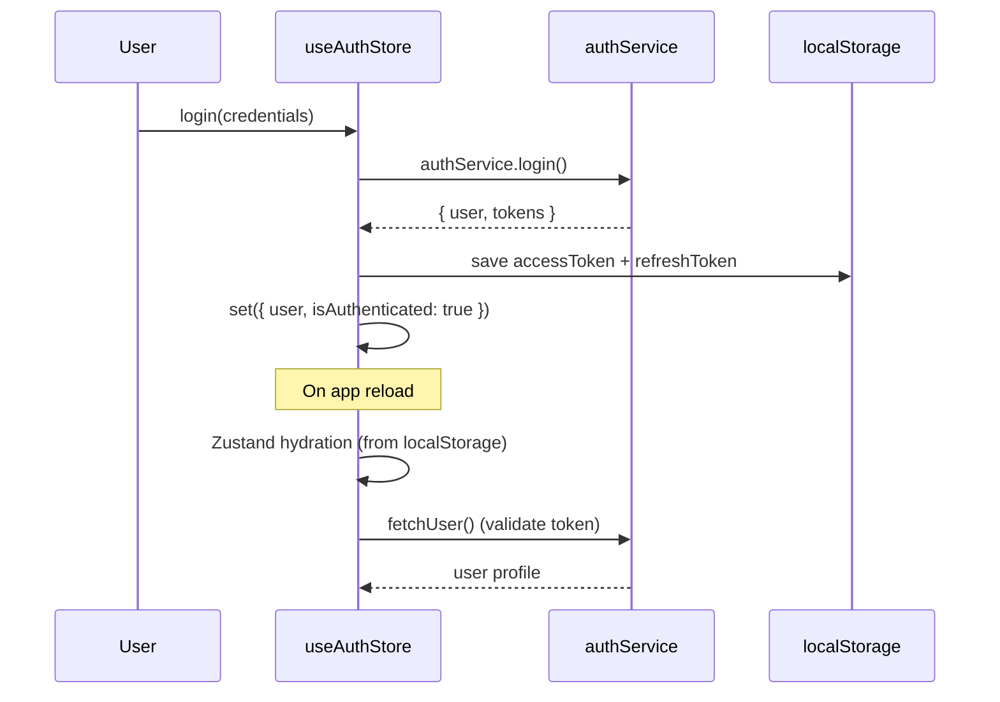
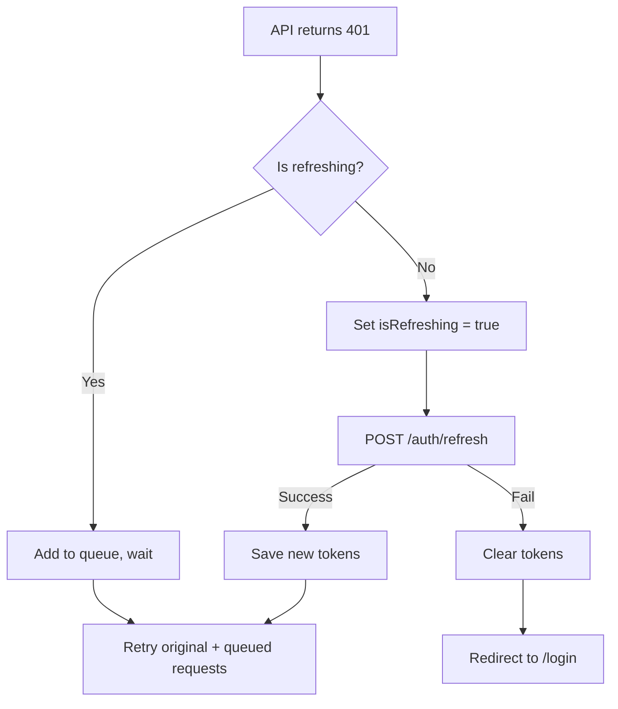
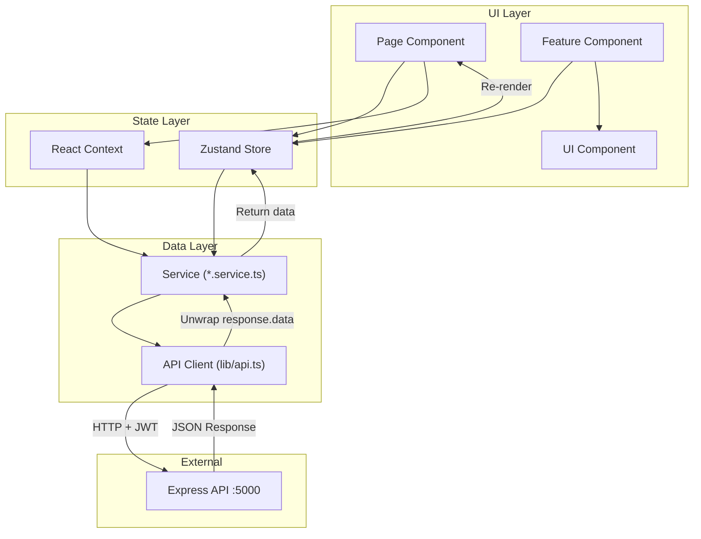

# ⚛️ Frontend Architecture — WorkflowHub

> **Version:** 1.0.0 · **Cập nhật:** 2026-03-03

## Mục Lục

- [1. App Router Structure](#1-app-router-structure)
- [2. Component Taxonomy](#2-component-taxonomy)
- [3. State Management (Zustand)](#3-state-management-zustand)
- [4. Service Layer](#4-service-layer)
- [5. API Client (Axios)](#5-api-client-axios)
- [6. Context Providers](#6-context-providers)
- [7. Custom Hooks](#7-custom-hooks)
- [8. Internationalization (i18n)](#8-internationalization-i18n)
- [9. Constants & Types](#9-constants--types)
- [10. Data Flow Diagram](#10-data-flow-diagram)

---

## 1. App Router Structure

Next.js App Router sử dụng **Route Groups** để phân biệt layout:

```
app/
├── layout.tsx              # Root layout (providers, fonts, metadata)
├── page.tsx                # Landing/redirect
├── globals.css             # Global styles (TailwindCSS)
│
├── (auth)/                 # Auth route group
│   ├── layout.tsx          # Centered layout (logo + form)
│   ├── login/
│   └── register/
│
├── (main)/                 # Main app route group
│   ├── layout.tsx          # Sidebar + header + content area
│   ├── dashboard/          # Dashboard page
│   ├── projects/           # Projects CRUD
│   │   ├── page.tsx        # List
│   │   ├── new/
│   │   └── [projectId]/    # Detail + edit
│   ├── tasks/              # Tasks CRUD (same pattern)
│   ├── issues/             # Issues CRUD
│   ├── documents/          # Documents CRUD
│   ├── categories/         # Categories management (tabs)
│   ├── members/            # User/member management
│   ├── agents/             # AI agents
│   ├── chat/               # AI chat interface
│   └── workflows/          # Workflow management
│
└── contexts/               # React Context providers
    ├── documents/           # Document form/list contexts
    ├── issues/              # Issue form/list contexts
    ├── tasks/               # Task form/list contexts
    ├── projects/            # Project contexts
    ├── members/             # Member contexts
    ├── ai/                  # AI contexts
    └── shared/              # Shared context utilities
```

### Route Pattern (per feature)

```
{feature}/
├── page.tsx                # List page (với filters, pagination)
├── new/
│   └── page.tsx            # Create page
└── [{id}]/
    ├── page.tsx            # Detail page
    └── edit/
        └── page.tsx        # Edit page
```

---

## 2. Component Taxonomy

```
components/
├── ui/                     # 🎨 Primitive UI (shadcn/ui style)
│   ├── button.tsx
│   ├── input.tsx
│   ├── dialog.tsx
│   ├── badge.tsx
│   ├── avatar.tsx
│   ├── tabs.tsx
│   ├── confirm-dialog.tsx  # Reusable confirm hook
│   └── ...                 # ~28 components
│
├── shared/                 # 🔄 Shared feature components
│   ├── Logo.tsx
│   ├── Pagination.tsx
│   ├── StatusBadge.tsx
│   ├── DescriptionSection.tsx
│   ├── SearchInput.tsx
│   └── ...                 # ~15 components
│
├── layout/                 # 📐 Layout components
│   ├── Sidebar.tsx
│   ├── Header.tsx
│   ├── page-layouts.tsx    # CrudLayout, ListPageLayout, DetailLayout
│   └── ...                 # ~17 components
│
├── projects/               # 📁 Feature-specific
│   ├── ProjectCard.tsx
│   ├── ProjectForm.tsx
│   ├── ProjectList.tsx
│   └── ProjectMembersTable.tsx
│
├── tasks/
├── issues/
├── documents/
├── categories/
├── members/
├── ai/                     # AI-specific components
│   ├── AgentCard.tsx
│   └── AgentForm.tsx
├── chat/                   # Chat-specific components
│   ├── ChatSidebar.tsx
│   ├── ChatHeader.tsx
│   ├── ChatMessageArea.tsx
│   ├── ChatInput.tsx
│   └── ...
└── dashboard/
    ├── StatsOverview.tsx
    ├── RecentProjects.tsx
    └── ActivityFeed.tsx
```

### Component Responsibilities

| Tier | Vị trí | Trách nhiệm | Ví dụ |
|------|--------|-------------|-------|
| **UI** | `components/ui/` | Presentation-only, no business logic | `Button`, `Input`, `Dialog` |
| **Shared** | `components/shared/` | Reusable across features | `Pagination`, `StatusBadge` |
| **Layout** | `components/layout/` | Page structure, navigation | `Sidebar`, `ListPageLayout` |
| **Feature** | `components/{feature}/` | Feature-specific UI + logic | `ProjectCard`, `IssueForm` |

---

## 3. State Management (Zustand)

### Store Pattern

```typescript
// Pattern chung cho tất cả stores
interface FeatureState {
  // Data
  items: Item[]
  selectedItem: Item | null
  // UI State
  isLoading: boolean
  error: string | null
  // Pagination
  currentPage: number
  totalPages: number
  // Actions
  fetchItems: (filters?) => Promise<void>
  createItem: (data) => Promise<Item>
  updateItem: (id, data) => Promise<void>
  deleteItem: (id) => Promise<void>
}
```

### Store Catalog

| Store | Persist? | Key Actions |
|-------|----------|-------------|
| `useAuthStore` | ✅ localStorage | `login`, `register`, `logout`, `fetchUser` |
| `useProjectStore` | ❌ | `fetchProjects`, `createProject`, `deleteProject` |
| `useTaskStore` | ❌ | `fetchTasks`, `createTask`, `updateTask`, `deleteTask` |
| `useIssueStore` | ❌ | `fetchIssues`, `createIssue`, `updateIssue`, `deleteIssue` |
| `useDocumentStore` | ❌ | `fetchDocuments`, `createDocument`, `deleteDocument` |
| `useCategoryStore` | ❌ | `fetchCategories`, `createCategory`, `deleteCategory` |
| `useStatusStore` | ❌ | `fetchStatuses`, `createStatus` |
| `useMemberStore` | ❌ | `fetchMembers`, `createMember`, `deleteMember` |
| `useAIStore` | ❌ | `fetchAgents`, `createAgent`, `deleteAgent` |
| `useLayoutStore` | ✅ localStorage | `toggleSidebar`, `setTheme` |

### Auth Store — Token Management



---

## 4. Service Layer

**Vị trí:** `services/*.service.ts`

Mỗi service là wrapper quanh API client, mapping 1:1 với backend module:

```typescript
// Pattern chung
import api from "@/lib/api"

export const featureService = {
  getAll: (params?) => api.get<ApiResponse>("/features", { params }),
  getById: (id: string) => api.get<ApiResponse>(`/features/${id}`),
  create: (data: CreateDTO) => api.post<ApiResponse>("/features", data),
  update: (id: string, data: UpdateDTO) => api.patch<ApiResponse>(`/features/${id}`, data),
  delete: (id: string) => api.delete(`/features/${id}`),
}
```

### Service Catalog

| Service | Endpoint Group | Methods |
|---------|---------------|---------|
| `authService` | `/auth` | `login`, `register`, `refresh`, `me` |
| `projectService` | `/projects` | CRUD + members |
| `taskService` | `/tasks` | CRUD |
| `issueService` | `/issues` | CRUD |
| `documentService` | `/documents` | CRUD |
| `categoryService` | `/categories` | CRUD (with `?type=`) |
| `memberService` | `/users` | CRUD + roles |
| `aiService` | `/agents` | CRUD + execute + clone + documents |
| `uploadService` | `/upload` | `uploadImage`, `deleteImage` |
| `workflowService` | `/workflows` | Templates + instances |
| `project-memberService` | `/projects/:id/members` | Add, update, remove |

---

## 5. API Client (Axios)

**File:** `lib/api.ts`

### Interceptors

| Type | Chức năng |
|------|----------|
| **Request** | Tự động gắn `Authorization: Bearer <token>` từ localStorage |
| **Response (success)** | Unwrap `response.data` (trả về data trực tiếp) |
| **Response (401)** | Auto-refresh token + retry request queue |

### Token Refresh Flow



- Request queue pattern: nhiều request 401 cùng lúc → chỉ 1 refresh call
- `_retry` flag ngăn infinite loop

---

## 6. Context Providers

**Vị trí:** `app/contexts/{feature}/`

Dùng React Context cho state phức tạp liên quan đến form/list trong một feature group:

| Context | File | Chức năng |
|---------|------|----------|
| `DocumentFormContext` | `contexts/documents/DocumentFormContext.tsx` | Form state cho create/edit document |
| `DocumentListContext` | `contexts/documents/DocumentListContext.tsx` | List + filter state |
| `IssueFormContext` | `contexts/issues/IssueFormContext.tsx` | Form state cho create/edit issue |
| `IssueListContext` | `contexts/issues/IssueListContext.tsx` | List + filter state |
| `TaskFormContext` | `contexts/tasks/TaskFormContext.tsx` | Form state cho create/edit task |
| `TaskListContext` | `contexts/tasks/TaskListContext.tsx` | List + filter state |
| `ProjectContext` | `contexts/projects/` | Project detail state |
| `MemberFormContext` | `contexts/members/` | Member form state |

### Context vs Zustand

| Tiêu chí | Zustand Store | React Context |
|----------|---------------|---------------|
| **Scope** | Global (app-wide) | Scoped (subtree) |
| **Use case** | Entity CRUD, auth, layout | Form state, page-level filters |
| **Persistence** | Optional (localStorage) | No |
| **Performance** | Selective subscription | Re-render subtree |

---

## 7. Custom Hooks

| Hook | File | Chức năng |
|------|------|----------|
| `useToast` | `hooks/use-toast.ts` | Toast notification management |
| `useChat` | `hooks/useChat.ts` | Chat UI logic (send message, scroll, streaming) |
| `useUrlFilters` | `hooks/useUrlFilters.ts` | Sync URL search params ↔ filter state |
| `useWorkflowStatuses` | `hooks/useWorkflowStatuses.ts` | Fetch workflow status options |
| `useConfirmDialog` | `components/ui/confirm-dialog.tsx` | Confirm dialog pattern (hook + component) |

---

## 8. Internationalization (i18n)

**File:** `lib/i18n.tsx`

### Setup

- React Context-based (không dùng thư viện ngoài)
- Type-safe keys: `TranslationKey` type tự động từ JSON structure
- Locales: `en.json`, `vi.json`
- Persistence: `localStorage` key `wfh_locale`

### Sử dụng

```typescript
import { useTranslation } from "@/lib/i18n"

function MyComponent() {
  const { t, locale, setLocale } = useTranslation()

  return <h1>{t("projects.title")}</h1>
}
```

### Translation Key Format

```json
{
  "projects": {
    "title": "Projects",
    "create": "Create Project",
    "actions": {
      "delete": "Delete"
    }
  }
}
```

→ Key: `"projects.title"`, `"projects.actions.delete"`

---

## 9. Constants & Types

### Constants (`constants/`)

| File | Nội dung |
|------|---------|
| `index.ts` | `API_URL`, `LOCAL_STORAGE_KEYS`, re-exports |
| `navigation.ts` | `SIDEBAR_ITEMS` — sidebar menu config |
| `sort-options.ts` | Sort options cho list pages |
| `table-columns.ts` | Column definitions cho tables |
| `ai.ts` | AI provider configs, model options |
| `workflow.ts` | Workflow type options |
| `ui-tokens.ts` | Color tokens, size tokens |
| `mock-data.ts` | Mock data cho development |

### Types (`types/`)

| File | Nội dung |
|------|---------|
| `index.ts` | Entity interfaces: `User`, `Project`, `Task`, `Issue`, `Document`, etc. |
| `schema.ts` | Full schema types (matching backend models) |
| `dtos.ts` | Request/response DTOs: `LoginCredentials`, `CreateProjectDTO`, etc. |
| `chat.ts` | Chat-specific types: `ChatMessage`, `ChatConversation` |

---

## 10. Data Flow Diagram



---

> **Xem thêm:**
> - [01 — Architecture Overview](./01-architecture-overview.md)
> - [04 — API Reference](./04-api-reference.md)
> - [08 — RBAC & Permissions](./08-rbac-permissions.md)
