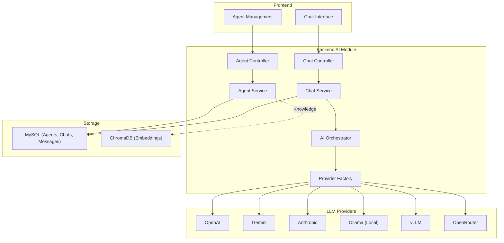
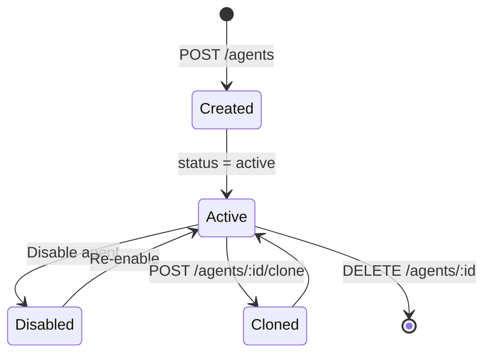
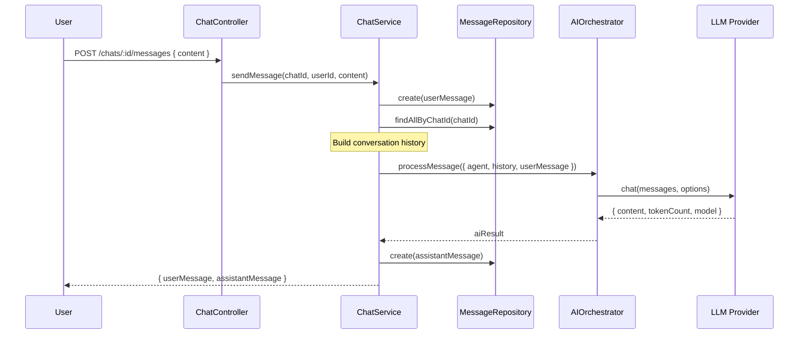
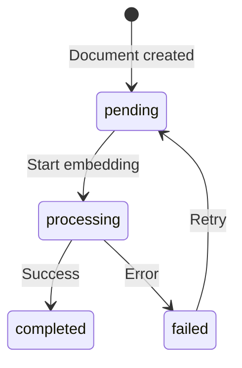

# 🤖 AI Module — WorkflowHub

> **Version:** 1.0.0 · **Cập nhật:** 2026-03-03

## Mục Lục

- [1. Tổng Quan](#1-tổng-quan)
- [2. Provider Architecture](#2-provider-architecture)
- [3. Agent System](#3-agent-system)
- [4. Chat System](#4-chat-system)
- [5. AI Orchestrator](#5-ai-orchestrator)
- [6. Knowledge Base (RAG)](#6-knowledge-base-rag)
- [7. Prompt Management](#7-prompt-management)
- [8. Configuration](#8-configuration)

---

## 1. Tổng Quan

AI Module cung cấp khả năng tích hợp LLM vào hệ thống quản lý dự án:

- **Agent Management:** Tạo và cấu hình AI agents với các vai trò chuyên biệt
- **Chat Interface:** Real-time conversation với AI agents
- **Multi-Provider:** Hỗ trợ nhiều LLM providers (OpenAI, Gemini, Ollama, ...)
- **RAG Support:** Retrieval-Augmented Generation với ChromaDB
- **Task Generation:** AI tự tạo tasks từ phân tích dự án



---

## 2. Provider Architecture

### LLMProvider Interface (Abstract)

```
providers/
├── llm-provider.interface.js    # Abstract base class
├── openai.provider.js           # OpenAI + OpenAI-compatible (Ollama, vLLM, Anthropic)
├── gemini.provider.js           # Google Gemini native
└── provider-factory.js          # Factory pattern
```

### Interface Contract

```javascript
class LLMProvider {
  constructor({ apiKey, model, baseUrl }) { ... }

  /**
   * @param {Array<{role: string, content: string}>} messages
   * @param {Object} options - { maxTokens, temperature }
   * @returns {Promise<{content: string, tokenCount: number, model: string}>}
   */
  async chat(messages, options = {}) { ... }
}
```

### Provider Registry

| Provider | Class | Env Key | Default Model | Base URL |
|----------|-------|---------|--------------|----------|
| `openai` | `OpenAIProvider` | `OPENAI_API_KEY` | `gpt-4o-mini` | OpenAI default |
| `gemini` / `google` | `GeminiProvider` | `GEMINI_API_KEY` | `gemini-2.0-flash` | Google default |
| `anthropic` | `OpenAIProvider` | `ANTHROPIC_API_KEY` | `claude-sonnet-4-20250514` | `https://api.anthropic.com/v1` |
| `ollama` | `OpenAIProvider` | `OLLAMA_API_KEY` (optional) | `llama3.1` | `http://127.0.0.1:11434/v1` |
| `vllm` | `OpenAIProvider` | `VLLM_API_KEY` (optional) | `default` | `http://127.0.0.1:8000/v1` |
| `openrouter` | `OpenAIProvider` | `OPENROUTER_API_KEY` | `openrouter/auto` | `https://openrouter.ai/api/v1` |

> **Key insight:** Ollama, vLLM, Anthropic, và OpenRouter đều dùng chung `OpenAIProvider` do chúng cung cấp OpenAI-compatible API.

### Factory Pattern

```javascript
import ProviderFactory from './providers/provider-factory.js';

// Tạo provider từ agent config
const provider = ProviderFactory.create(
  agent.provider,     // 'openai' | 'gemini' | ...
  agent.model,        // 'gpt-4o' | 'gemini-2.0-flash' | ...
  agent.base_url,     // Custom URL (optional)
  agent.api_key       // Per-agent API key (optional, fallback to env)
);

const result = await provider.chat(messages, { temperature: 0.7 });
// → { content: "...", tokenCount: 150, model: "gpt-4o" }
```

---

## 3. Agent System

### Agent Roles

| Role | Mô tả | Use case |
|------|-------|---------|
| `pm` | Project Manager | Lập kế hoạch, phân tích requirements |
| `developer` | Developer | Code review, technical advice |
| `reviewer` | Reviewer | Quality assurance, review |
| `analyst` | Business Analyst | Phân tích nghiệp vụ |
| `writer` | Content Writer | Documentation, report |
| `custom` | Custom | User-defined role |

### Agent Types

| Type | Mô tả | Config Field |
|------|-------|-------------|
| `conversational` | Chat-based interaction | `ai_settings` |
| `task` | One-shot task execution | `output_config` |
| `orchestrator` | Multi-agent coordination | `orchestrator_config` |
| `autonomous` | Self-running with goals | `autonomous_config` |

### Agent Configuration Fields

| Field | Type | Mô tả |
|-------|------|-------|
| `system_prompt` | TEXT | System instruction cho LLM |
| `ai_settings` | JSON | `{ temperature, maxTokens, topP }` |
| `guardrails` | JSON | Safety rules, content filters |
| `rag_config` | JSON | RAG settings (collection, topK) |
| `enabled_tools` | JSON | Available tools list |
| `output_config` | JSON | Output formatting rules |
| `orchestrator_config` | JSON | Sub-agents, routing rules |
| `autonomous_config` | JSON | Goals, stop conditions |

### Agent Lifecycle



---

## 4. Chat System

### Chat Flow



### Message Metadata

```json
{
  "tokenCount": 150,
  "model": "gpt-4o",
  "sources": [],
  "tool_calls": []
}
```

### Auto-Title

Khi conversation chưa có title và đây là message đầu tiên → tự động set title từ 50 ký tự đầu của user message.

---

## 5. AI Orchestrator

**File:** `services/ai-orchestrator.service.js`

Orchestrator là layer trung gian giữa ChatService và LLM Provider:

1. Lấy agent config (provider, model, settings)
2. Build message array (system prompt + history + user message)
3. Tạo provider qua Factory
4. Gọi `provider.chat()` với settings từ agent
5. Trả về kết quả thống nhất

```javascript
class AIOrchestrator {
  async processMessage({ agent, history, userMessage }) {
    const provider = ProviderFactory.create(
      agent.provider, agent.model, agent.base_url, agent.api_key
    );

    const messages = [
      { role: 'system', content: agent.system_prompt },
      ...history.map(m => ({ role: m.role, content: m.content })),
      { role: 'user', content: userMessage },
    ];

    return provider.chat(messages, agent.ai_settings || {});
  }
}
```

---

## 6. Knowledge Base (RAG)

### ChromaDB Integration

| Component | Mô tả |
|-----------|-------|
| **ChromaDB** | Vector database (Docker: port 8001) |
| **Documents** | Nguồn knowledge (field `embedding_status`) |
| **Agent Documents** | Junction table `agent_documents` |

### Document Embedding Status



### RAG Flow (khi triển khai đầy đủ)

1. User gắn documents vào agent (`POST /agents/:id/documents`)
2. Documents được embed vào ChromaDB
3. Khi chat, user message được dùng để query ChromaDB
4. Relevant chunks được thêm vào context trước khi gửi LLM
5. LLM trả lời dựa trên context + knowledge

---

## 7. Prompt Management

**File:** `prompts/system-prompts.js`

Quản lý system prompts mặc định cho từng agent role:

```javascript
const SYSTEM_PROMPTS = {
  pm: "You are a Project Manager AI assistant...",
  developer: "You are a Senior Developer AI assistant...",
  reviewer: "You are a Code Reviewer AI assistant...",
  analyst: "You are a Business Analyst AI assistant...",
  writer: "You are a Technical Writer AI assistant...",
  custom: "You are a helpful AI assistant.",
};
```

Agents có thể override bằng field `system_prompt` riêng.

---

## 8. Configuration

### Environment Variables

| Biến | Mô tả | Bắt buộc |
|------|-------|----------|
| `OPENAI_API_KEY` | OpenAI API key | Nếu dùng OpenAI |
| `GEMINI_API_KEY` | Google Gemini API key | Nếu dùng Gemini |
| `ANTHROPIC_API_KEY` | Anthropic API key | Nếu dùng Anthropic |
| `OPENROUTER_API_KEY` | OpenRouter API key | Nếu dùng OpenRouter |
| `OLLAMA_API_KEY` | Ollama key | ❌ (optional, local) |
| `VLLM_API_KEY` | vLLM key | ❌ (optional, local) |
| `CHROMA_HOST` | ChromaDB host | Nếu dùng RAG |
| `CHROMA_PORT` | ChromaDB port | Nếu dùng RAG |

### Per-Agent API Key

Mỗi agent có thể có `api_key` riêng, ưu tiên cao hơn env variable:

```
Priority: agent.api_key > process.env[PROVIDER_ENV_KEY]
```

---

> **Xem thêm:**
> - [01 — Architecture Overview](./01-architecture-overview.md)
> - [03 — Database Schema](./03-database-schema.md) — Bảng agents, chats, messages
> - [04 — API Reference](./04-api-reference.md) — AI endpoints
