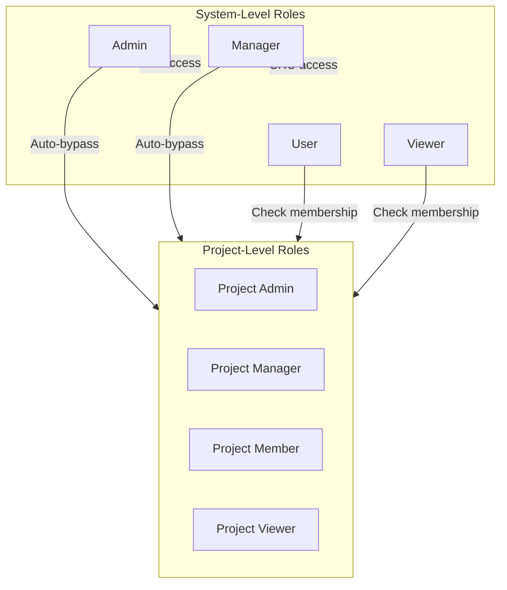
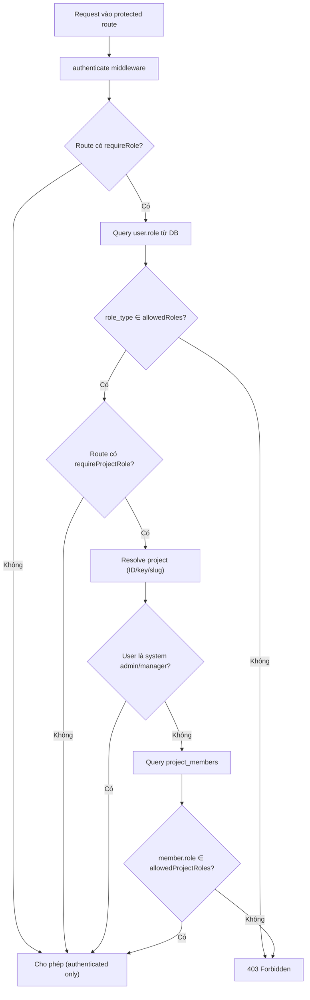

# 🔐 RBAC & Permissions — WorkflowHub

> **Version:** 1.0.0 · **Cập nhật:** 2026-03-03

## Mục Lục

- [1. Tổng Quan RBAC](#1-tổng-quan-rbac)
- [2. System Roles](#2-system-roles)
- [3. Project Roles](#3-project-roles)
- [4. Permission Matrix](#4-permission-matrix)
- [5. Backend Implementation](#5-backend-implementation)
- [6. Frontend Implementation](#6-frontend-implementation)
- [7. Role Resolution Flow](#7-role-resolution-flow)

---

## 1. Tổng Quan RBAC

WorkflowHub sử dụng hệ thống RBAC 2 cấp:



| Cấp | Middleware | Bảng | Scope |
|-----|-----------|------|-------|
| **System-Level** | `requireRole()` | `roles` → `users.role_id` | Global (tất cả resources) |
| **Project-Level** | `requireProjectRole()` | `project_members.role` | Chỉ trong project cụ thể |

---

## 2. System Roles

Được lưu trong bảng `roles` với field `role_type`:

| Role Type | Tên hiển thị | Mô tả |
|-----------|-------------|-------|
| `admin` | Administrator | Toàn quyền trên hệ thống |
| `manager` | Manager | Quản lý users, projects, categories |
| `user` | User | Tạo/sửa work items, chat AI |
| `viewer` | Viewer | Chỉ xem, không sửa đổi |

### Role Hierarchy

```
admin > manager > user > viewer
```

Admin và Manager tự động bypass project-level checks.

---

## 3. Project Roles

Được lưu trong `project_members.role`:

| Role | Mô tả |
|------|-------|
| `admin` | Toàn quyền trong project (xóa project, quản lý members) |
| `manager` | Quản lý members, sửa project |
| `member` | Tạo/sửa work items |
| `viewer` | Chỉ xem |

---

## 4. Permission Matrix

### System-Level Permissions

| Resource | Action | Admin | Manager | User | Viewer |
|----------|--------|:-----:|:-------:|:----:|:------:|
| **Users** | List / View | ✅ | ✅ | ✅ | ✅ |
| | Create | ✅ | ✅ | ❌ | ❌ |
| | Update / Delete | ✅ | ✅ | ❌ | ❌ |
| **Categories** | List / View | ✅ | ✅ | ✅ | ✅ |
| | Create / Update | ✅ | ✅ | ❌ | ❌ |
| | Delete | ✅ | ❌ | ❌ | ❌ |
| **Projects** | List / View | ✅ | ✅ | ✅ | ✅ |
| | Create | ✅ | ✅ | ❌ | ❌ |

### Project-Level Permissions

| Resource | Action | Project Admin | Project Manager | Member | Viewer |
|----------|--------|:------------:|:---------------:|:------:|:------:|
| **Project** | Update | ✅ | ✅ | ❌ | ❌ |
| | Delete | ✅ | ❌ | ❌ | ❌ |
| **Members** | List | ✅ | ✅ | ✅ | ✅ |
| | Add / Update | ✅ | ✅ | ❌ | ❌ |
| | Remove | ✅ | ✅ | ❌ | ❌ |

### Open Resources (Authenticated Only)

Không có RBAC check, chỉ cần authenticated:

| Resource | Ghi chú |
|----------|---------|
| Tasks | CRUD cho tất cả authenticated users |
| Issues | CRUD cho tất cả authenticated users |
| Documents | CRUD cho tất cả authenticated users |
| Statuses | CRUD cho tất cả authenticated users |
| AI Agents | CRUD cho tất cả authenticated users |
| Chat | CRUD cho tất cả authenticated users |
| Workflows | CRUD cho tất cả authenticated users |
| Upload | Authenticated users |

---

## 5. Backend Implementation

### 5.1. `requireRole` Middleware

**File:** `shared/middleware/rbac.middleware.js`

```javascript
export function requireRole(allowedRoleTypes) {
  return async (req, _res, next) => {
    const user = await db.User.findByPk(req.user.id, {
      include: [{ model: db.Role, as: 'role' }],
    });

    if (!allowedRoleTypes.includes(user.role.role_type)) {
      throw new ForbiddenError(`Requires one of roles: ${allowedRoleTypes.join(', ')}`);
    }

    req.userRole = user.role;
    next();
  };
}
```

**Sử dụng trong routes:**

```javascript
// Chỉ admin và manager
router.post('/', requireRole([ROLE_TYPES.ADMIN, ROLE_TYPES.MANAGER]), controller.create);

// Chỉ admin
router.delete('/:id', requireRole([ROLE_TYPES.ADMIN]), controller.delete);
```

### 5.2. `requireProjectRole` Middleware

```javascript
export function requireProjectRole(allowedProjectRoles) {
  return async (req, _res, next) => {
    // 1. Resolve project (by ID, key, or slug)
    let project = await db.Project.findByPk(req.params.projectId);
    if (!project) {
      project = await db.Project.findOne({
        where: { [Op.or]: [{ key }, { slug }] }
      });
    }

    // 2. System Admin/Manager → auto-bypass
    const user = await db.User.findByPk(userId, { include: 'role' });
    if (user.role.role_type === 'admin' || user.role.role_type === 'manager') {
      return next();
    }

    // 3. Check project membership + role
    const member = await db.ProjectMember.findOne({
      where: { project_id, user_id: userId }
    });

    if (!allowedProjectRoles.includes(member.role)) {
      throw new ForbiddenError('Insufficient project role');
    }

    next();
  };
}
```

### 5.3. Route RBAC Summary

| Route File | RBAC Middleware |
|-----------|---------------|
| `auth.routes.js` | Không (public + authenticate) |
| `project.routes.js` | `requireRole` (create) + `requireProjectRole` (update, delete, members) |
| `user.routes.js` | `requireRole([ADMIN, MANAGER])` cho CUD |
| `category.routes.js` | `requireRole([ADMIN, MANAGER])` cho CU, `requireRole([ADMIN])` cho D |
| `task.routes.js` | Không (authenticated only) |
| `issue.routes.js` | Không (authenticated only) |
| `document.routes.js` | Không (authenticated only) |
| `status.routes.js` | Không (authenticated only) |
| `agent.routes.js` | Không (authenticated only) |
| `chat.routes.js` | Không (authenticated only) |
| `workflow.routes.js` | Không (authenticated only) |
| `upload.routes.js` | Không (authenticated only) |

---

## 6. Frontend Implementation

### 6.1. Auth Store — Role Access

```typescript
// Từ useAuthStore
const { user } = useAuthStore()
const userRole = user?.role?.role_type // 'admin' | 'manager' | 'user' | 'viewer'
```

### 6.2. Conditional Rendering

```tsx
// Ẩn nút Create nếu user/viewer
const canCreate = ['admin', 'manager'].includes(userRole)

return (
  <>
    {canCreate && (
      <Button onClick={handleCreate}>Create</Button>
    )}
  </>
)
```

### 6.3. Pattern cho Role-Based UI

```tsx
// Pattern hay dùng trong feature pages
const { user } = useAuthStore()
const isAdmin = user?.role?.role_type === 'admin'
const isManager = user?.role?.role_type === 'manager'
const canManage = isAdmin || isManager
const canDelete = isAdmin

return (
  <div>
    {canManage && <Button>Edit</Button>}
    {canDelete && <Button variant="destructive">Delete</Button>}
  </div>
)
```

---

## 7. Role Resolution Flow



---

> **Xem thêm:**
> - [04 — API Reference](./04-api-reference.md) — RBAC annotations per endpoint
> - [05 — Backend Architecture](./05-backend-architecture.md) — Middleware pipeline
> - [06 — Frontend Architecture](./06-frontend-architecture.md) — Auth store
