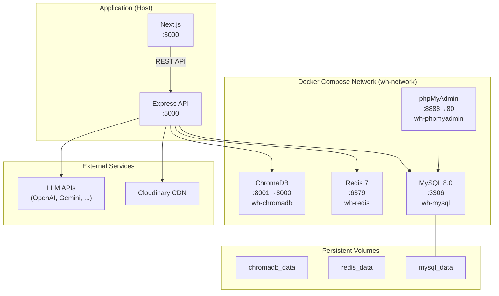

# 🚢 Deployment — WorkflowHub

> **Version:** 1.0.0 · **Cập nhật:** 2026-03-03

## Mục Lục

- [1. Docker Compose Topology](#1-docker-compose-topology)
- [2. Service Configuration](#2-service-configuration)
- [3. Production Environment](#3-production-environment)
- [4. Health Checks](#4-health-checks)
- [5. Monitoring & Logging](#5-monitoring--logging)
- [6. Backup & Restore](#6-backup--restore)
- [7. Deployment Checklist](#7-deployment-checklist)

---

## 1. Docker Compose Topology



---

## 2. Service Configuration

### MySQL 8.0

| Config | Value |
|--------|-------|
| Image | `mysql:8.0` |
| Container | `wh-mysql` |
| Port | `${DB_PORT:-3306}:3306` |
| Volume | `mysql_data:/var/lib/mysql` |
| Health Check | `mysqladmin ping -h localhost` (10s interval) |

### Redis 7

| Config | Value |
|--------|-------|
| Image | `redis:7-alpine` |
| Container | `wh-redis` |
| Port | `${REDIS_PORT:-6379}:6379` |
| Volume | `redis_data:/data` |
| Persistence | `save 60 1` (mỗi 60s nếu có ≥1 change) |
| Health Check | `redis-cli ping` (10s interval) |

### ChromaDB

| Config | Value |
|--------|-------|
| Image | `chromadb/chroma:latest` |
| Container | `wh-chromadb` |
| Port | `${CHROMA_PORT:-8001}:8000` |
| Volume | `chromadb_data:/chroma/chroma` |
| Persistence | `IS_PERSISTENT=TRUE` |

### phpMyAdmin

| Config | Value |
|--------|-------|
| Image | `phpmyadmin/phpmyadmin` |
| Container | `wh-phpmyadmin` |
| Port | `8888:80` |
| Depends On | `mysql` (healthy) |

---

## 3. Production Environment

### 3.1. Biến môi trường BẮT BUỘC thay đổi

| Biến | Dev Value | Production Action |
|------|-----------|------------------|
| `NODE_ENV` | `development` | → `production` |
| `JWT_ACCESS_SECRET` | `dev-access-secret` | → Strong random string (≥64 chars) |
| `JWT_REFRESH_SECRET` | `dev-refresh-secret` | → Strong random string (≥64 chars) |
| `JWT_ACCESS_EXPIRY` | `15m` | Giữ nguyên hoặc giảm |
| `DB_ROOT_PASSWORD` | `rootpassword` | → Strong password |
| `DB_PASSWORD` | `wh_password` | → Strong password |
| `CORS_ORIGIN` | `http://localhost:3000` | → Production domain |

### 3.2. Biến môi trường Production-specific

| Biến | Giá trị khuyến nghị | Mô tả |
|------|---------------------|-------|
| `LOG_LEVEL` | `info` | Giảm log verbosity |
| `RATE_LIMIT_MAX` | `100` | Requests per window |
| Domain SSL | Required | HTTPS cho frontend + API |

### 3.3. Build Commands

```bash
# Build backend
pnpm build:api

# Build frontend
pnpm build:web

# Hoặc build tất cả
pnpm build
```

---

## 4. Health Checks

### API Health Endpoint

```bash
curl http://localhost:5000/health
```

```json
{
  "success": true,
  "data": {
    "status": "healthy",
    "uptime": 86400,
    "environment": "production",
    "timestamp": "2026-03-03T10:00:00.000Z"
  }
}
```

### Docker Health Checks

```bash
# Kiểm tra tất cả containers
docker ps --format "table {{.Names}}\t{{.Status}}\t{{.Ports}}"

# Kiểm tra health status
docker inspect wh-mysql --format='{{.State.Health.Status}}'
docker inspect wh-redis --format='{{.State.Health.Status}}'
```

---

## 5. Monitoring & Logging

### Winston Logger Configuration

| Environment | Console | File Output |
|-------------|---------|-------------|
| Development | Colorized, verbose | ❌ |
| Production | JSON format | ✅ `logs/error.log` + `logs/combined.log` |

### Log Files

| File | Level | Max Size | Rotation |
|------|-------|----------|----------|
| `logs/error.log` | error only | 5 MB | 5 files |
| `logs/combined.log` | all levels | 5 MB | 5 files |

### Docker Logs

```bash
# Xem logs real-time
pnpm docker:logs

# Xem logs service cụ thể
docker logs wh-mysql --tail 100
docker logs wh-redis --tail 100
```

---

## 6. Backup & Restore

### MySQL Backup

```bash
# Backup
docker exec wh-mysql mysqldump -u root -p${DB_ROOT_PASSWORD} ${DB_NAME} > backup_$(date +%Y%m%d).sql

# Restore
docker exec -i wh-mysql mysql -u root -p${DB_ROOT_PASSWORD} ${DB_NAME} < backup_20260303.sql
```

### Redis Backup

```bash
# Redis tự động save mỗi 60s (config: save 60 1)
# Manual save
docker exec wh-redis redis-cli BGSAVE

# Backup file
docker cp wh-redis:/data/dump.rdb ./redis_backup.rdb
```

### ChromaDB Backup

```bash
# Copy volume data
docker cp wh-chromadb:/chroma/chroma ./chromadb_backup/
```

### Full Reset

```bash
pnpm docker:down
docker volume rm workflowhub_mysql_data workflowhub_redis_data workflowhub_chromadb_data
pnpm docker:up
# Đợi MySQL healthy (~30s)
pnpm db:migrate
pnpm db:seed
```

---

## 7. Deployment Checklist

### Pre-Deploy

- [ ] Thay đổi tất cả secrets (JWT, DB passwords)
- [ ] Set `NODE_ENV=production`
- [ ] Set `CORS_ORIGIN` = production domain
- [ ] Set `LOG_LEVEL=info`
- [ ] Cấu hình SSL/TLS (HTTPS)
- [ ] Cấu hình Cloudinary credentials
- [ ] Cấu hình AI provider API keys (nếu dùng)

### Deploy

- [ ] `pnpm install --frozen-lockfile`
- [ ] `pnpm docker:up`
- [ ] Đợi MySQL healthy
- [ ] `pnpm db:migrate`
- [ ] `pnpm build`
- [ ] Start API server (PM2 / systemd)
- [ ] Start Next.js (PM2 / systemd)

### Post-Deploy

- [ ] Verify health endpoint: `curl https://api.domain.com/health`
- [ ] Verify frontend loads
- [ ] Test login flow
- [ ] Test CRUD operations
- [ ] Kiểm tra logs cho errors
- [ ] Setup automated backups
- [ ] Setup monitoring/alerting

### Security Checklist

- [ ] Rate limiting enabled (production mode)
- [ ] Helmet headers active
- [ ] JWT secrets are strong & unique
- [ ] Database passwords are strong
- [ ] CORS origin whitelist configured
- [ ] No `console.log` in production code
- [ ] Error messages don't leak internals (production mode)
- [ ] phpMyAdmin disabled hoặc behind VPN

---

> **Xem thêm:**
> - [01 — Architecture Overview](./01-architecture-overview.md)
> - [02 — Getting Started](./02-getting-started.md)
